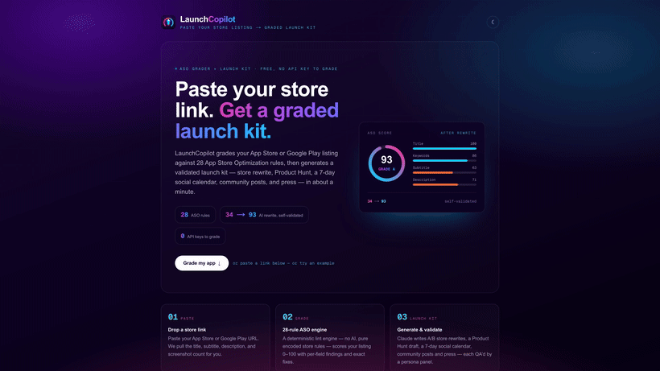
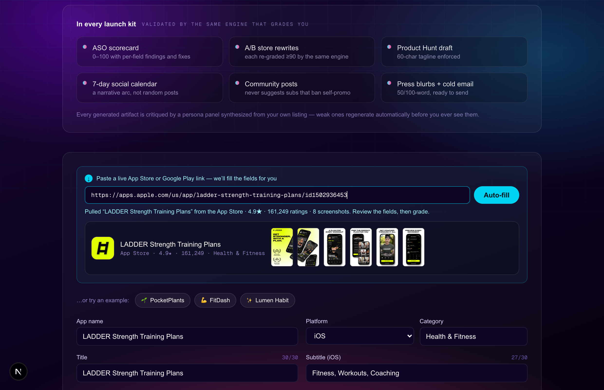
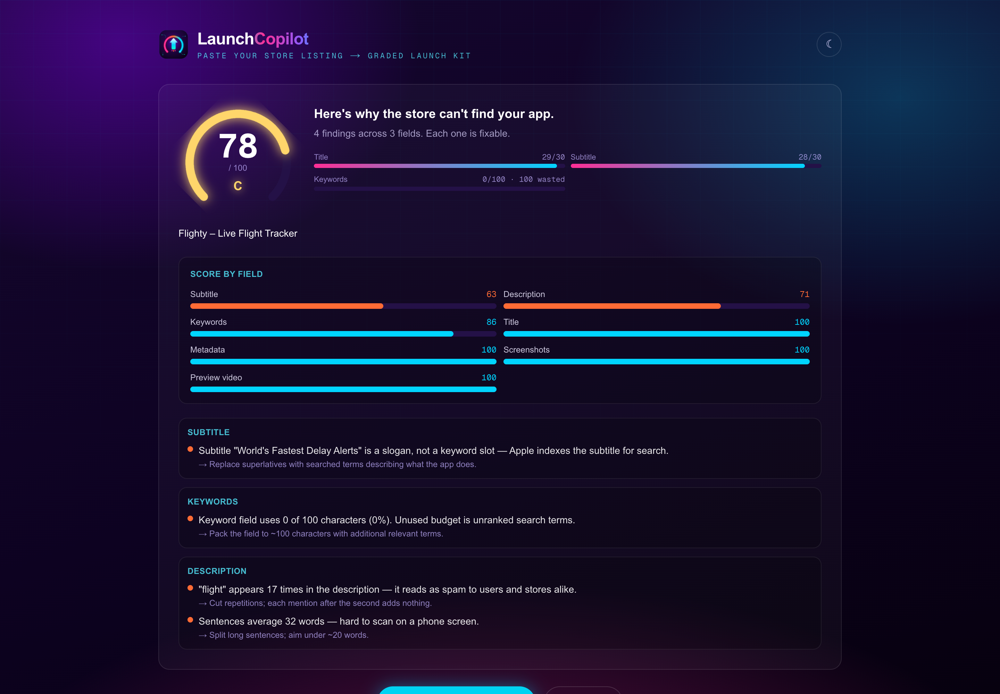
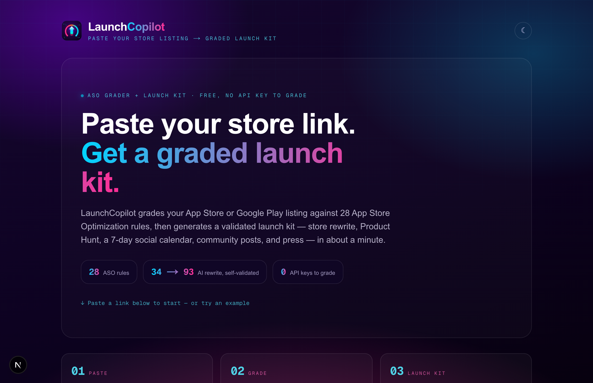
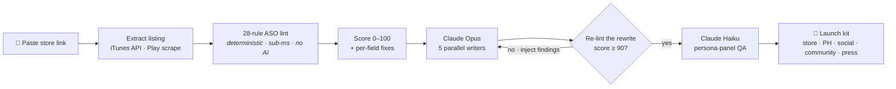

<div align="center">

  

  <h1>LaunchCopilot 🚀</h1>

  <p><em>Paste your app&rsquo;s store listing → a graded, validated launch kit — in about a minute.</em></p>

  

  <br/>

[](https://launchcopilot.edycu.dev)
[](https://launchcopilot.edycu.dev/pitch)
[](https://youtu.be/2if0sEFKe8c)
[](https://hackonvibe.com)

  <br/>


[](https://opensource.org/licenses/MIT)
[](https://github.com/edycutjong/launchcopilot/actions/workflows/ci.yml)

</div>

---

## 📸 See it in Action

<div align="center">



<sub><em>~15s, no audio — paste a store link → auto-fill → the deterministic 27/100 grade → a generated launch kit that re-grades itself to ≥ 90.</em></sub>

</div>

| 1 · Paste a link → auto-fill | 2 · Grade (28 rules) | 3 · Landing → live tool |
|---|---|---|
|  |  |  |
| Paste an App Store / Google Play URL → the real icon, rating, screenshots, and every field fill in. | Deterministic score with per-field bars + exact fixes (light/dark). | A pitch that flows straight into the working grader. |

> ▶ **Try it yourself, no signup, no key:** [launchcopilot.edycu.dev](https://launchcopilot.edycu.dev) — paste **your** app's link and watch it grade.

## ✅ Deterministic, not vibes

**The grader is deterministic — no AI. 28 encoded App Store / Google Play rules, 150 passing tests, sub-millisecond p95.**

Reproduce with `npm run aso-lint` (or `npm test`) — it scores any listing **0–100** with per-field findings and exact fixes, and the *same* engine re-grades the AI's rewrite and forces **≥90 or regenerates**, so the machine is judged by the same deterministic grader as the human.

**Don't trust us — verify it in your browser:** paste **your own** app's App Store / Google Play link on the [live site](https://launchcopilot.edycu.dev) (no signup, no key) and watch it grade, then generate a validated launch kit.

*Honest status: the ASO lint + repair loop is fully deterministic and load-bearing; the generative kit uses Claude (`claude-opus-4-8`) with a Haiku critic pass and runs in `DEMO_MODE=1` with no API key, so judges can reproduce everything locally.*

## 💡 The Problem & Solution

Solo developers ship good apps and get **six downloads — four of them friends.** Not because the app is bad, but because its store listing quietly breaks App Store Optimization rules they've never heard of, and launch marketing (ASO, Product Hunt mechanics, per-community etiquette) is a specialist skill they can't buy at $2–5k an agency.

**LaunchCopilot performs the launch, not advice about it.** Paste your listing → it grades your ASO against 28 deterministic rules, then generates a validated launch kit that's **provably store-legal — because the same engine that grades you also grades the AI.**

**Key Features**
- 🔗 **Paste-a-link auto-fill** — drop an App Store / Google Play URL and the whole listing (title, subtitle, description, screenshots, rating) is pulled in for you. *(No AI — official iTunes API + Play scrape.)*
- 📊 **28-rule ASO engine** — deterministic, sub-millisecond, scores 0–100 with per-field findings and exact fixes. Pure encoded store rules, no model.
- ♻️ **Validator-in-the-loop** — the AI's rewritten listing is re-linted and **auto-repaired until it scores ≥ 90**; the model is held to the same bar as the human.
- 🎭 **Persona-panel QA** — a focus group synthesized from your own listing critiques every artifact in-character; weak ones regenerate before you see them.
- 🆓 **Free API + CLI, no key to grade** — `POST /api/analyze` · `npm run aso-lint` · runs fully in `DEMO_MODE`.

## 🏗️ Architecture & Tech Stack

**Next.js 16 + React 19 + Tailwind v4** (one codebase, app + API) · **Claude** (`claude-opus-4-8` writers + `claude-haiku-4-5` persona panel) · **Zod** schema-constrained generation · **Vitest / Playwright / semantic-release** for the harness.



**Where the interesting code lives** (for judges skimming the source):

| Capability | File |
|---|---|
| 28-rule ASO engine (the deterministic judge) | [`src/lib/aso-lint/rules.ts`](src/lib/aso-lint/rules.ts) |
| Paste-a-link extraction + `/api/extract` | [`src/lib/extract/index.ts`](src/lib/extract/index.ts) · [`src/app/api/extract/route.ts`](src/app/api/extract/route.ts) |
| Validator-in-the-loop kit pipeline | [`src/lib/pipeline/`](src/lib/pipeline/) |
| Free grading API (no key) | [`src/app/api/analyze/route.ts`](src/app/api/analyze/route.ts) |
| Self-contained pitch deck (served at `/pitch`) | [`public/pitch/index.html`](public/pitch/index.html) |

## 🎯 HackOnVibe theme fit

The theme is **effective promotion of a newly launched mobile app** — LaunchCopilot is that, end to end: it grades the listing (promotion surface #1), rewrites it to pass, and produces the Product Hunt / social / community / press assets that *are* the launch. And it **recurs** — every app update is a re-launch, so Re-grade + Content-Refill regenerate next week's kit in a click.

## 🚀 Run it Locally (For Judges)

```bash
npm install
npm test                                              # 150 unit tests
npm run aso-lint -- data/fixtures/pocketplants.json   # CLI: 27/100 (F) + fixes
npm run dev                                           # app at http://localhost:3000
```

> **Note for judges — you can skip the API key.** Grading, the CLI, and the E2E suite all run with **no credentials** (`DEMO_MODE`). A key (`ANTHROPIC_API_KEY` in `.env.local`) is only needed to generate the AI launch kit; the deterministic grader never needs one.

**Grade any listing over HTTP — no key required:**
```bash
curl -X POST http://localhost:3000/api/analyze \
  -H 'content-type: application/json' -d @data/fixtures/pocketplants.json
```

## 🧪 Testing & engineering harness

A **6-stage CI/CD pipeline** runs on every push (Quality → Security → Build → E2E → Performance → Deploy gate). When it goes green on `main`, a separate **Release** workflow runs [semantic-release](https://semantic-release.gitbook.io): it reads the conventional commits, computes the next version, updates the changelog, and publishes a tagged GitHub Release automatically.

```bash
npm run ci          # lint + typecheck + tests with coverage (the quality gate)
npm run e2e         # Playwright E2E (demo mode — no API key)
npm run release:dry # preview the next semantic version locally
```

| Layer | Tooling | Status |
|---|---|---|
| Code quality | ESLint + TypeScript strict | ✅ |
| Unit tests | Vitest — **150 tests, 100% coverage** of the deterministic core | ✅ |
| E2E tests | Playwright — 3 suites (smoke · API · responsive), desktop + mobile | ✅ |
| Security (SAST) | CodeQL | ✅ |
| Security (SCA) | Dependabot + `npm audit` | ✅ |
| Secret scanning | TruffleHog (verified) | ✅ |
| Performance | Lighthouse CI | ✅ |
| Releases | semantic-release (conventional commits → semver, auto GitHub Release) | ✅ |
| Community profile | CoC · Contributing · Security · issue/PR templates | ✅ 100% |

**Benchmark** (`npm run bench`, 5,000 runs over 3 fixtures): the lint engine runs at **p50 0.39 ms · p95 0.86 ms · ~2,180 listings/sec** — fast enough to be the AI's inline validator on every repair attempt.

## 🐛 Build notes — a few bugs worth remembering

- **The SVG logo was pinned to (0,0).** In the animated README hero, a CSS `transform` (the bob animation) silently *overrode* the element's `transform="translate()"` attribute — so the icon ignored every position I set. Fix: split positioning (outer group, attribute) from animation (inner group, CSS).
- **A stopword leak flipped a rule.** The "what does your app do" text was matched against the description without filtering stopwords, so "the/for/your" counted as real content — caught only because a test expected a finding that didn't fire.
- **Google Play embeds rival apps' copy.** The paste-a-link extractor first grabbed the *longest* description on the page — which was a competitor's. Fixed by matching the description to the target app via distinctive name/tagline tokens.
- **The social-proof regex missed real phrasing.** "Rated 4.8 by 3,200 users" didn't match the first pattern; a fixture pinned the expected score and surfaced it.

## ⚠️ Honest limitations

No auth yet · IP-based rate limits reset on redeploy · rules encode public ASO best practices, not Apple's private ranking algorithm · English-only v1 · paste-a-link extraction is best-effort — the App Store subtitle is anchored to the app's own listing object (never a neighbouring app's), and anything it can't confidently read is flagged, never guessed.

## 📄 License

Released under the [MIT License](LICENSE). © 2026 Edy Cu.

<sub>Thank you for reviewing LaunchCopilot. — Edy</sub>
